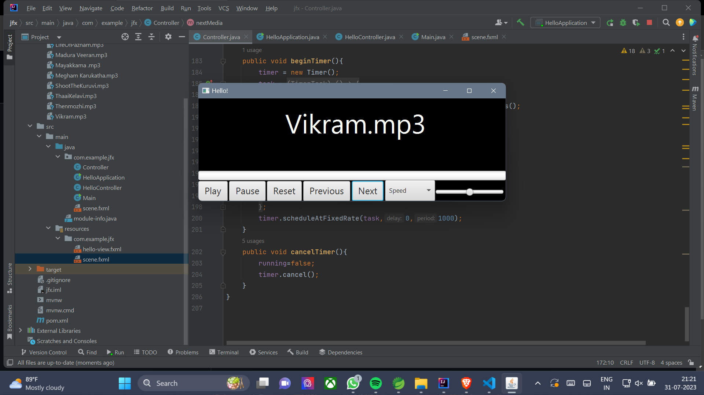

# Basic Desktop Music Player with JavaFX

This is a basic desktop music player application built with JavaFX. It allows users to play, pause, skip, reset, control speed, and adjust the volume of their music tracks. The player supports various audio formats and provides a simple and intuitive user interface for a hassle-free music listening experience.

## Features

- Play/Pause: Start or pause the playback of the currently selected music track.
- Next/Previous: Skip to the next or previous track in the playlist.
- Reset: Reset the playback of the currently selected track to the beginning.
- Speed Control: Adjust the playback speed of the music track.
- Volume Control: Adjust the volume level using a convenient slider.

## Screenshots

## Getting Started

### Prerequisites

Make sure you have the following software installed on your system:

- Java SE Development Kit (JDK) 11 or later
- JavaFX SDK

### Installation

1. Clone the repository to your local machine.

`git clone https://github.com/your-username/desktop-music-player.git`

1.  Set up the project in your favorite Java IDE (e.g., IntelliJ IDEA, Eclipse) by importing the project as a JavaFX project.

2.  Build and run the application from your IDE.

### Usage
-----

1.  Launch the music player application on your desktop.

2.  Add your music tracks to the playlist using the "Add Music" button or by dragging and dropping files into the playlist.

3.  Use the play, pause, next, and previous buttons to control the music playback.

4.  Use the reset button to start the currently selected track from the beginning.

5.  Adjust the speed slider to control the playback speed of the music track.

6.  Adjust the volume slider to control the volume level.

### Contributing
------------

We welcome contributions to enhance the functionality and user experience of this music player. If you have any ideas or improvements, feel free to open an issue or submit a pull request.

### License
-------

This music player is open-source and licensed under the [MIT License](LICENSE).

### Acknowledgments
---------------

Special thanks to the  JavaFX community for their contributions and support.

### Contact
-------

If you have any questions or feedback, please don't hesitate to contact us at <pradeepkumar15v06@gmail.com>.

Happy Listening! 🎵🎧
